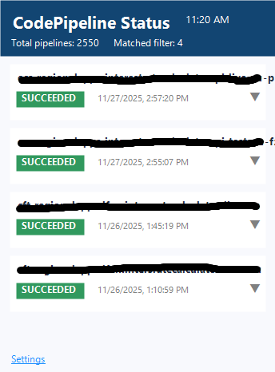

# AWS CodePipeline Status - Chrome Extension

A secure, client-side Chrome extension to monitor AWS CodePipeline statuses from your browser toolbar.

## Overview

The popup dashboard (built with React 18, TypeScript, Vite, and TanStack Query) calls AWS CodePipeline directly through the official AWS SDK v3 and stores credentials only inside Chrome’s sandboxed storage. A Manifest V3 service worker schedules refreshes without ever sending data to third-party servers, so everything stays in your browser.



## Feature

- **Live pipeline list** with total and filtered counts, status badges, and quick manual refresh.
- **Execution summaries** for each pipeline, including timestamps pulled via `listPipelineExecutions`.
- **Smart filtering & rate limiting** so long AWS orgs can search thousands of pipelines without spamming the API.
- **Auto-refresh loop** backed by the background service worker and alarms (default 3 minutes, min 30 seconds).
- **Secure credential handling** that optionally assumes IAM roles before instantiating the `CodePipelineClient`.
- **Error-first UX** with toast + inline messaging, making misconfigured credentials obvious.

## Prerequisites

- Chromium browser with Manifest V3 support (Chrome/Edge 88+).
- Node.js 18+ (development and local builds).
- AWS account with CodePipeline access and the ability to create IAM users/roles.
- Optional: AWS CLI for verifying permissions.

## IAM Setup

Create a least-privilege IAM identity that can read CodePipeline metadata before entering credentials in the extension.

### Option 1: AWS managed policy (recommended)

1. IAM Console → Users → **Create user** (e.g., `CodePipelineMonitor`).
2. Attach the `AWSCodePipeline_ReadOnlyAccess` managed policy.
3. Generate an access key (Security credentials → **Create access key** → Third-party service).

### Option 2: Custom minimal policy

```json
{
  "Version": "2012-10-17",
  "Statement": [
    {
      "Effect": "Allow",
      "Action": [
        "codepipeline:ListPipelines",
        "codepipeline:ListPipelineExecutions"
      ],
      "Resource": "*"
    }
  ]
}
```

### Cross-account access (optional)

1. Create the IAM user in your primary account.
2. In the target account, create an IAM role with the same read-only permissions.
3. Update the role’s trust policy to allow the user to assume it.
4. Copy the role ARN into the extension settings (`Role ARN to Assume`).

## Installation

### From source (current workflow)

```bash
git clone https://github.com/yourusername/aws-codepipeline-status.git
cd aws-codepipeline-status
npm install
npm run build
```

Then load the generated `dist` folder via `chrome://extensions` → **Load unpacked** (Developer Mode enabled).

## Configuration

1. Click the toolbar icon and open **Settings**.
2. Fill in the required fields:
   - **AWS Access Key ID**
   - **AWS Secret Access Key**
   - **AWS Region** (e.g., `us-east-1`, `ap-southeast-2`)
3. Optional enhancements:
   - **Role ARN to Assume** for cross-account reads.
   - **Pipeline Name Filter** (case-insensitive substring).
   - **Refresh Interval** (>= 30 seconds).
4. Click **Test Connection** to validate credentials/permissions.
5. Click **Save Settings** to persist everything in Chrome storage.


