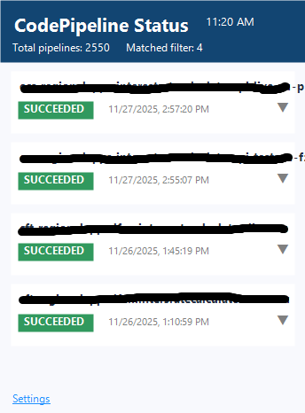

# AWS CodePipeline Status - Chrome Extension

A secure, client-side Chrome extension to monitor AWS CodePipeline statuses from your browser toolbar.

## Overview

Built with React 18, TypeScript, Vite, and TanStack Query. Calls AWS directly via the AWS SDK v3 and stores credentials only inside Chrome's sandboxed storage — no third-party servers.



## Features

- **Live pipeline list** with total and filtered counts, status badges, and quick manual refresh.
- **Execution summaries** for each pipeline, including timestamps pulled via `listPipelineExecutions`.
- **Pending approval detection** showing deployment runs waiting for manual approval with a one-click approve action.
- **Multi-filter chips** — add one or more pipeline name filters (case-insensitive substring match). Enter, Tab, or comma commits a chip; Backspace removes the last one.
- **Auto-refresh loop** backed by a Manifest V3 service worker and alarms (default 3 minutes, minimum 30 seconds).
- **Key rotation** — generate a new IAM access key, validate it against CodePipeline, save it, then delete the old key, all from the settings page.
- **Secure credential handling** with AES-256-GCM encryption for the Secret Access Key at rest, and optional IAM role assumption for cross-account access.
- **Error-first UX** with toast and inline messaging.

## Prerequisites

- Chromium browser with Manifest V3 support (Chrome/Edge 88+).
- Node.js 18+ for local builds.
- AWS account with CodePipeline access and an IAM user/role.

## IAM Setup

Create an IAM user with the following permissions. The `iam:*AccessKey` actions are only required if you want to use the **Rotate Key** feature.

```json
{
  "Version": "2012-10-17",
  "Statement": [
    {
      "Effect": "Allow",
      "Action": [
        "codepipeline:ListPipelines",
        "codepipeline:ListPipelineExecutions",
        "codepipeline:GetPipelineState",
        "codepipeline:PutApprovalResult",
        "iam:CreateAccessKey",
        "iam:DeleteAccessKey"
      ],
      "Resource": "*"
    }
  ]
}
```

**Setup steps:**
1. IAM Console → Users → **Create user** (e.g., `CodePipelineMonitor`).
2. Attach the policy above (omit the `iam:*AccessKey` actions if not using Rotate Key).
3. Security credentials → **Create access key** → Third-party service.

### Cross-account access (optional)

1. In the target account, create an IAM role with the same CodePipeline permissions and a trust policy allowing your IAM user to assume it.
2. Copy the role ARN into the extension settings under **Role ARN to Assume**.

## Installation

```bash
git clone https://github.com/yourusername/aws-codepipeline-status.git
cd aws-codepipeline-status
npm install
npm run build
```

Load the generated `dist` folder via `chrome://extensions` → **Load unpacked** (Developer Mode enabled).

## Configuration

1. Click the toolbar icon and open **Settings**.
2. Fill in **AWS Access Key ID**, **AWS Secret Access Key**, and **AWS Region**.
3. Optional enhancements:
   - **Role ARN to Assume** — for cross-account reads.
   - **Pipeline Name Filters** — one or more case-insensitive substring chips.
   - **Refresh Interval** — minimum 30 seconds (default 3 minutes).
4. Click **Test Connection** to validate credentials and permissions.
5. Click **Save Settings**.

### Rotate Key

The **Rotate Key** button on the settings page creates a new IAM access key, verifies it against CodePipeline, saves it to storage, and then deletes the old key. The old key is only deleted after the new one passes a `ListPipelines` test, so a failed validation leaves your original credentials intact.

## Security

Your **AWS Secret Access Key** is encrypted at rest using AES-256-GCM (PBKDF2, 100,000 iterations) before being stored in Chrome's local storage. The Access Key ID and other settings are stored in plain text.

To use a custom encryption passphrase, edit the `ENCRYPTION_PASSPHRASE` constant in `src/utils/crypto.ts` before building. Changing it after saving credentials requires re-entering the Secret Access Key.
